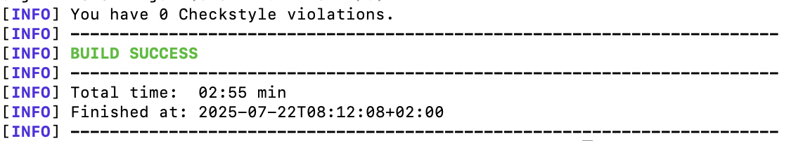
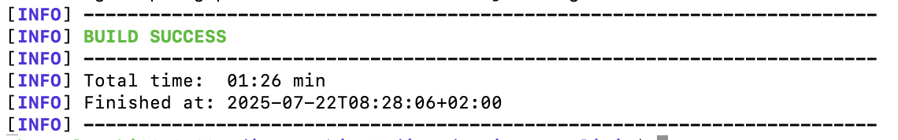
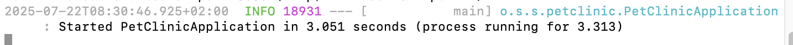
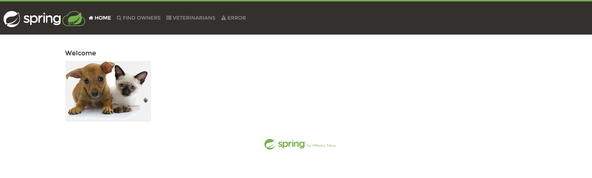
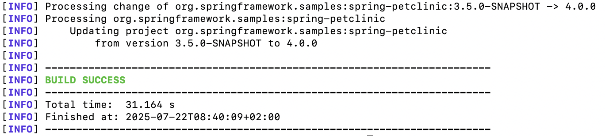
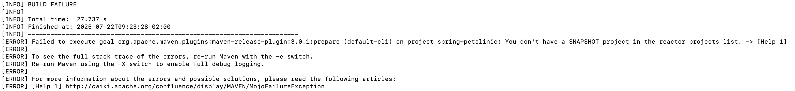
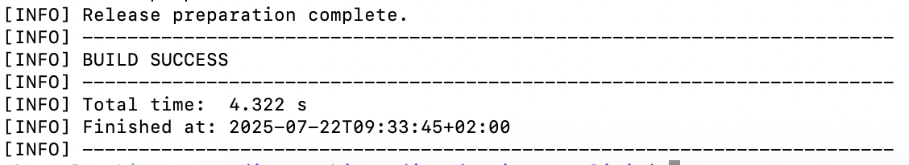
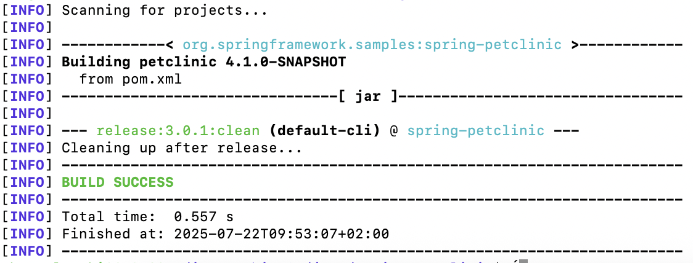

# maven_practical_tasks

1-2. Install locally the latest versions of Java and Maven.
    ​​Go to https://github.com/spring-projects/spring-petclinic, fork it and clone the forked repo.

Done


3\. Perform validation to check if the project is correct.

Commands:
    
    mvn validate

<p align="center">  </p>

3\. Build JAR artifact from source code, run the application locally and see the web interface in the browser.

Command:
    
    mvn package

<p align="center">  </p>

Command:

    java -jar target/*.jar

<p align="center">  </p>

Browser check:

    http://localhost:8080

<p align="center">  </p>


4\. Increase project Major version (e.g. from 3.2.0 to 4.0.0) without interactive mode. Use release plugin.

Okay, by default you can just change pom.xml file, like this:

from:

    <version>3.2.0</version>

to:

    <version>4.0.0</version>


But to change it non-itectively we should use a plugin `"Versions Maven Plugin"`.

Command:

    mvn versions:set -DnewVersion=4.0.0 -DgenerateBackupPoms=false

Result:

<p align="center">  </p>


6\. In the pom file add <scm> section with your repo address. Prepare code to release.

Pasted code into the "\<project\>" in the `"pom.xml"`:


```xml
<scm>
    <connection>scm:git:https://github.com/mboguslawsk/spring-petclinic.git</connection>
    <developerConnection>scm:git:git@github.com:mboguslawsk/spring-petclinic.git</developerConnection>
    <url>https://github.com/mboguslawsk/spring-petclinic#</url>
    <tag>HEAD</tag>
</scm>
```

Where:

- `<connection>` - anonymous read access to the repository.

- `<developerConnection>` - read/write access (via SSH).

- `<url>` - the browser-accessible URL for the repo.

- `<tag>` - the tag Maven will use when releasing. Normally set to HEAD (current commit) during development.


7\. Try to prepare a release in non-interactive mode.

Pasted xml-code in the `<plugins>` scope:

``` xml
<plugin>
    <groupId>org.apache.maven.plugins</groupId>
    <artifactId>maven-release-plugin</artifactId>
    <version>3.0.1</version>
</plugin>
```

Commited. And run a command to prepare for release:

```
    mvn release:clean release:prepare -B \
  -DreleaseVersion=4.0.0 \
  -Dtag=4.0.0 \
  -DdevelopmentVersion=4.1.0-SNAPSHOT
```

Where `SNAPSHOT` version is a work-in-progress version.

Got error, which means that current version needs to end in `-SNAPSHOT`:

<p align="center">  </p>

So I had to change it using this command and after that commited changes:

    mvn versions:set -DnewVersion=4.0.0-SNAPSHOT -DgenerateBackupPoms=false

After that success:

<p align="center">  </p>

7-8\. Try to perform the release of artifacts.


Command for release:

    mvn release:perform -B

Error appeared, which has been resolved by editing `<plugin>` scope (not deploying to the Maven repo):

``` xml
<plugin>
  <groupId>org.apache.maven.plugins</groupId>
  <artifactId>maven-release-plugin</artifactId>
  <configuration>
    <goals>clean verify</goals>
  </configuration>
</plugin>
```

Success:

<p align="center">  </p>

9\. Perform release cleanup.

Clean up command:

    mvn release:clean

Result:

<p align="center">  </p>
